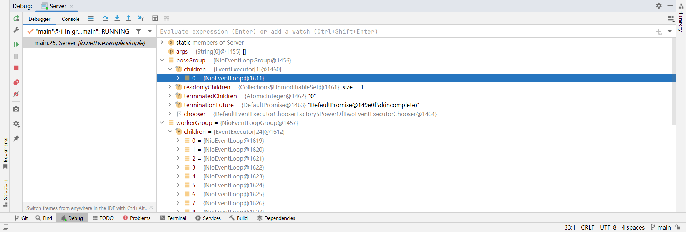

# Netty 4.1.90.Final 源码分析 

https://netty.io/

https://github.com/netty/netty


## Jdk Future 和 Netty Future Promise 区别

都可以理解为是装载线程结果的容器

Jdk Future 当前线程同步等待另一个线程结果   future.get()  
Netty Future 当前线程同步或异步等待另一个线程结果 future.get() future.addListener()  
Netty Promise 当前线程同步或异步等待另一个线程结果，跟future不同的是，它可以主动设置另一个线程的结果

Future 一般被动创建，被动设置结果
Promise 一般主动创建，主动设置结果

注：在异常处理上也会有差别 

## execute 和 submit 区别

execute 只可提交 Runnable 没返回值任务，而且方法调用没有返回值
submit 可提交 Runnable 没返回值任务，也可以提交 Callable 有返回值任务，方法调用返回Future对象  

## 重要组件

1. ServerBootstrap、BootStrap 启动类，门面类，门面设计模式，这个类是方便用户快速使用Netty的门面类
2. Channel 通道类，如果是服务端，那么Channel是NioServerSocketChannel，或者时服务端和客户端的通道NioSocketChannel，如果是客户端Channel是客户端与服务端的通道NioSocketChannel
3. Pipeline 每个Channel都有一个流水线，每个流水线有多个处理器，当Channel有事件发生时，每个事件会经过流水线的每一个处理器，
   事件的触发由pipeline对象触发，例如pipeline.fireChannelRegistered();  
   ServerSocketChannel会有一个Pipeline，  
   每个服务端与客户端的SocketChannel也有一个Pipeline  
   pipeline使用链表方式连接所有handler的上下文对象，  
   每个pipeline都有初始的head和tail  
   调用pipeline.addLast()，会往head和tail中间以链表的方式追加  
   始终保证head在链表最开始，tail在链表最后面，  
   也就是始终保证head先执行，tail最后执行，中间的其他Handler按addLast顺序依次执行，最后一个自定义的Handler的Context的next会指向tail  
   head -> h1 -> h2 -> h3 -> h4 -> h5 -> h6 -> tail  
   双向链表  
   入站时，例如有ChannelRead事件，数据会从head一直流向tail，除非中间断开  
   出站时，例如有write事件，数据会从tail一直流向head，除非中间断开  
          如果是channel.write，会从tail一直流向head  
          如果是context.write，会从当前的处理器一直流向head  
4. Handler 流水线里面的事件处理器，分入站、出站
5. EventLoopGroup 事件循环组，里面有多个EventLoop对象，每个EventLoop对象绑定一个线程 类比JDK ExecutorService

## 服务端启动、接受客户端连接、读取消息、响应消息、断开连接源码

调试代码 netty-4.1.90.Final/example/src/main/java/io/netty/example/simple

1. ServerBootstrap bootstrap = new ServerBootstrap();

服务端创建ServerBootstrap，门面类，方便使用Netty

2. bootstrap.group(bossGroup, workerGroup)

EventLoopGroup bossGroup = new NioEventLoopGroup(1);  接受客户端连接，线程数一个即可
EventLoopGroup workerGroup = new NioEventLoopGroup();

bossGroup里面children只有一个NioEventLoop  
workerGroup里面children有24个NioEventLoop (CPU 12核*2)



bootstrap的group设置为bossGroup，一个Acceptor，用来接受客户端连接，并把与客户端Channel相关的事件交于workGroup处理
bootstrap的chindGroup设置为workerGroup，一个客户端工作组，处理客户端Channel的各种事件

3. bootstrap.channel(NioServerSocketChannel.class)

设置服务端Channel由那个类创建，

NioServerSocketChannel的一个父类AbstractNioChannel，有个属性ch，记录者Java的Channel对象，例如java.nio.channels.ServerSocketChannel

java.nio.channels.ServerSocketChannel是SelectableChannel的子类

SelectableChannel也就是可以使用多路复用器Selector的Channel

```java
public abstract class AbstractNioChannel extends AbstractChannel {
    // ...
    private final SelectableChannel ch;
    // ...
}
```

另外它的父类AbstractChannel还有个pipeline属性，每个Channel只有一个pipeline

public abstract class AbstractChannel extends DefaultAttributeMap implements Channel {

```java
public abstract class AbstractChannel extends DefaultAttributeMap implements Channel {
    // ...
    private final DefaultChannelPipeline pipeline;
    // ...
}
```

4. bootstrap.option(ChannelOption.SO_BACKLOG, 100)

设置一些服务端Channel通道选项

有链表的HashMap，键是ChannelOption，值是具体的值

```java
public abstract class AbstractBootstrap<B extends AbstractBootstrap<B, C>, C extends Channel> implements Cloneable {
    // ...
    private final Map<ChannelOption<?>, Object> options = new LinkedHashMap<ChannelOption<?>, Object>();
    // ...
}
```

ChannelOption.SO_BACKLOG对应的是tcp/ip协议, listen函数 中的 backlog 参数，用来初始化服务端可连接队列。

```
// backlog 指定了内核为此套接口排队的最大连接个数；
// 对于给定的监听套接口，内核要维护两个队列: 未连接队列和已连接队列
// backlog 的值即为未连接队列和已连接队列的和。
listen(int socketfd,int backlog)
```

5. bootstrap.childHandler()

ServerBootstrap有childHandler属性，其父类AbstractBootstrap有handler属性

每个ServerBootstrap只有一个handler和一个childHandler

> option和childOption group和childGroup handler和childHandler

handler处理客户端连接的事情，childHandler处理客户端连接后的事情

handler是通道处理器ChannelHandler，需要是ChannelHandler或其子类的实例

```java
public class ServerBootstrap extends AbstractBootstrap<ServerBootstrap, ServerChannel> {
    // ...
    private final Map<ChannelOption<?>, Object> childOptions = new LinkedHashMap<ChannelOption<?>, Object>();
    private final Map<AttributeKey<?>, Object> childAttrs = new ConcurrentHashMap<AttributeKey<?>, Object>();
    private volatile EventLoopGroup childGroup;
    private volatile ChannelHandler childHandler;
    // ...
}
public abstract class AbstractBootstrap<B extends AbstractBootstrap<B, C>, C extends Channel> implements Cloneable {
    // ...
    private final Map<ChannelOption<?>, Object> options = new LinkedHashMap<ChannelOption<?>, Object>();
    private final Map<AttributeKey<?>, Object> attrs = new ConcurrentHashMap<AttributeKey<?>, Object>();
    volatile EventLoopGroup group;
    private volatile ChannelHandler handler;
    // ...
}
```

6.  bootstrap.bind(8080) 

返回 ChannelFuture 对象

绑定端口 8080，使用指定的NioServerSocketChannel创建服务端Channel，初始化服务端Channel

监听客户端连接

```java

AbstactBootstrap.java

    private ChannelFuture doBind(final SocketAddress localAddress) {
        // 初始化 和 注册
        final ChannelFuture regFuture = initAndRegister();
    }
    
    final ChannelFuture initAndRegister() {
        Channel channel = null;
        try {
            // 创建了ServerSocketChannel 使用NioServerSocketChannel
            // 并创建了ServerSocketChannel的Pipeline
            channel = channelFactory.newChannel();
            // 初始化channel
            init(channel);
        } catch (Throwable t) {
        }
    }

AbstractNioChannel.java    
    
    protected DefaultChannelPipeline newChannelPipeline() {
        return new DefaultChannelPipeline(this);
    }
    
DefaultChannelPipeline.java    
    
    protected DefaultChannelPipeline(Channel channel) {
        this.channel = ObjectUtil.checkNotNull(channel, "channel");
        succeededFuture = new SucceededChannelFuture(channel, null);
        voidPromise =  new VoidChannelPromise(channel, true);
        // 尾上下文
        tail = new TailContext(this);
        // 头上下文
        head = new HeadContext(this);
        // 头的下一个是尾
        head.next = tail;
        // 尾的上一个是头
        tail.prev = head;
    }    
    
ServerBootstrap.java    
    
    void init(Channel channel) {
        // 设置通道选项
        setChannelOptions(channel, newOptionsArray(), logger);
        // 设置通道属性
        setAttributes(channel, newAttributesArray());
        // 获取通道的流水线
        ChannelPipeline p = channel.pipeline();
        // 当前子事件循环组
        final EventLoopGroup currentChildGroup = childGroup;
        // 当前子处理器
        final ChannelHandler currentChildHandler = childHandler;
        final Entry<ChannelOption<?>, Object>[] currentChildOptions = newOptionsArray(childOptions);
        final Entry<AttributeKey<?>, Object>[] currentChildAttrs = newAttributesArray(childAttrs);
        // ServerSocketChannel流水线最后增加一个处理器
        // 默认已经有head和tail，各个Handler被封装成Context，各个Context使用链表的方式连接
        // pipeline使用head tail     
        p.addLast(new ChannelInitializer<Channel>() {
            @Override  // 初始化NioServerSocketChannel
            public void initChannel(final Channel ch) {
                // 获取pipeline
                final ChannelPipeline pipeline = ch.pipeline();
                // 获取bootstrap的handler属性
                // 没设置，则为null
                ChannelHandler handler = config.handler();
                if (handler != null) {
                    pipeline.addLast(handler);
                }
                // ch.eventLoop() 获取到 eventLoop属性
                // 调试可知，这个eventLoop就是NioEventLoopGroup bossGroup里面的一个唯一的eventLoop
                // 执行任务
                ch.eventLoop().execute(new Runnable() {
                    @Override
                    public void run() {
                        // 流水线添加最后一个处理器
                        // ServerBootstrapAcceptor 接受客户端连接
                        pipeline.addLast(new ServerBootstrapAcceptor(
                                // NioServerSocketChannle
                                // 子组 子处理器 子选项 子属性
                                ch, currentChildGroup, currentChildHandler, currentChildOptions, currentChildAttrs));
                    }
                });
            }
        });
    }
    
ServerBootstrap.java
    
    ServerBootstrapAcceptor   
    // channelRead事件处理
    public void channelRead(ChannelHandlerContext ctx, Object msg) {
            // 这里的msg是与客户端建立连接后的NioSocketChannel对象
            // msg = {NioSocketChannel@1954} "[id: 0x76a90a12, L:/127.0.0.1:8080 - R:/127.0.0.1:54323]"
            final Channel child = (Channel) msg;
            // 与客户端的channel的流水线添加最后一个 
            // 把之前配置的childHandler添加进去
            child.pipeline().addLast(childHandler);
            // 设置子选项 子属性
            // NioSocketChannel是由NioServerSocketChannel里面进行创建
            // 所以channel有一定的子父关系
            setChannelOptions(child, childOptions, logger);
            setAttributes(child, childAttrs);

            try {
                // 子组注册这个Channel，监听其读事件以及其他事件
                childGroup.register(child).addListener(new ChannelFutureListener() {
                    @Override
                    public void operationComplete(ChannelFuture future) throws Exception {
                        if (!future.isSuccess()) {
                            forceClose(child, future.cause());
                        }
                    }
                });
            } catch (Throwable t) {
                forceClose(child, t);
            }
        }
        
MultithreadEventLoopGroup.java

    public ChannelFuture register(Channel channel) {
        // 下一个EventLoop对象注册Channel
        // next()是负载均衡，例如24个EventLoop，轮询算法平均分配给每个EventLoop
        // register() 与客户端的Channel和Eventloop绑定
        // 每个与客户端的Channel的所有事件都始终由一个Eventloop管理
        return next().register(channel);
    }
    
SingleThreadEventLoop.java

    public ChannelFuture register(Channel channel) {
        return register(new DefaultChannelPromise(channel, this));
    }
    
AbstractChannel.java

    private void register0(ChannelPromise promise) {
            try {
                // check if the channel is still open as it could be closed in the mean time when the register
                // call was outside of the eventLoop
                if (!promise.setUncancellable() || !ensureOpen(promise)) {
                    return;
                }
                // 第一次注册 true
                boolean firstRegistration = neverRegistered;
                // 注册
                doRegister();
                neverRegistered = false;
                // 已注册的 true
                registered = true;

                // Ensure we call handlerAdded(...) before we actually notify the promise. This is needed as the
                // user may already fire events through the pipeline in the ChannelFutureListener.
                pipeline.invokeHandlerAddedIfNeeded();
                
                safeSetSuccess(promise);
                // 流水线 触发 ChannelRegistered 事件
                pipeline.fireChannelRegistered();
                // Only fire a channelActive if the channel has never been registered. This prevents firing
                // multiple channel actives if the channel is deregistered and re-registered.
    
                // 判断Channel是否是打开状态 活跃状态
                //  return isOpen() && javaChannel().socket().isBound();
                if (isActive()) {
                    if (firstRegistration) {
                        // 第一次注册 触发 channelActive事件
                        pipeline.fireChannelActive();
                    } else if (config().isAutoRead()) {
                        // This channel was registered before and autoRead() is set. This means we need to begin read
                        // again so that we process inbound data.
                        //
                        // See https://github.com/netty/netty/issues/4805
                        beginRead();
                    }
                }
            } catch (Throwable t) {
                // Close the channel directly to avoid FD leak.
                closeForcibly();
                closeFuture.setClosed();
                safeSetFailure(promise, t);
            }
        }
        
AbstractNioChannel.java

    protected void doRegister() throws Exception {
        boolean selected = false;
        for (;;) {
            try {
                // javaChannel()是底层java.nio的SocketChannel
                // 注册到一个selector
                selectionKey = javaChannel().register(eventLoop().unwrappedSelector(), 0, this);
                return;
            } catch (CancelledKeyException e) {
                if (!selected) {
                    // Force the Selector to select now as the "canceled" SelectionKey may still be
                    // cached and not removed because no Select.select(..) operation was called yet.
                    eventLoop().selectNow();
                    selected = true;
                } else {
                    // We forced a select operation on the selector before but the SelectionKey is still cached
                    // for whatever reason. JDK bug ?
                    throw e;
                }
            }
        }
    }

DefaultChannelPipeline.java

    public final ChannelPipeline fireChannelRegistered() {
        // 调用ChannelRegisterd head头上下文
        AbstractChannelHandlerContext.invokeChannelRegistered(head);
        return this;
    }

AbstractChannelHandlerContext.java

    static void invokeChannelRegistered(final AbstractChannelHandlerContext next) {
        // 第一次next是head 处理器上下文
        EventExecutor executor = next.executor();
        if (executor.inEventLoop()) {
            next.invokeChannelRegistered();
        } else {
            executor.execute(new Runnable() {
                @Override
                public void run() {
                    next.invokeChannelRegistered();
                }
            });
        }
    }
    
    
    private void invokeChannelRegistered() {
        if (invokeHandler()) {
            try {
                // DON'T CHANGE
                // Duplex handlers implements both out/in interfaces causing a scalability issue
                // see https://bugs.openjdk.org/browse/JDK-8180450
                final ChannelHandler handler = handler();
                final DefaultChannelPipeline.HeadContext headContext = pipeline.head;
                // 第一次是headContext
                // 调用headContext的channelRegistered 
                // 传递处理器上下文对象
                if (handler == headContext) {
                    headContext.channelRegistered(this);
                } else if (handler instanceof ChannelDuplexHandler) {
                    ((ChannelDuplexHandler) handler).channelRegistered(this);
                } else {
                    // 第二次执行这里
                    ((ChannelInboundHandler) handler).channelRegistered(this);
                }
            } catch (Throwable t) {
                // 如果处理过程出现一次，执行invokeExceptionCaught
                invokeExceptionCaught(t);
            }
        } else {
            fireChannelRegistered();
        }
    }
```

全局搜索，可以快速定位到底层

SelectionKey.OP_ACCEPT  
SelectionKey.OP_READ

## pipeline.addLast()

与客户端的SocketChannel的pipeline，  
默认
head={DefaultChannelPipeline$HeadContext@1952}
    prev=null
    next={DefaultChannelPipeline$HeadContext@1953}
tail={DefaultChannelPipeline$TailContext@1953} ChannelHandlerContext(DefaultChannelPipeline$TailContext#0, [id: 0x12d4d4a2, L:/127.0.0.1:8080 - R:/127.0.0.1:57803])
    prev={DefaultChannelPipeline$HeadContext@1952}
    next=null
底层会默认addLast(childHandler)
head={DefaultChannelPipeline$HeadContext@1952}
    prev=null
    // 这是childHander的上下文
    next={DefaultChannelHandlerContext@1959}
        prev={DefaultChannelPipeline$HeadContext@1952}
        next={DefaultChannelPipeline$TailContext@1953}
tail={DefaultChannelPipeline$TailContext@1953} ChannelHandlerContext(DefaultChannelPipeline$TailContext#0, [id: 0x12d4d4a2, L:/127.0.0.1:8080 - R:/127.0.0.1:57803])
    prev={DefaultChannelHandlerContext@1959}
    next=null
如果再一次addLast()
head={DefaultChannelPipeline$HeadContext@1952}
    prev=null
    // 这是childHander的上下文
    next={DefaultChannelHandlerContext@1959}
        prev={DefaultChannelPipeline$HeadContext@1952}
        // 这是新加的Handler上下文
        next={DefaultChannelHandlerContext@2026}  
            prev={DefaultChannelHandlerContext@1959}
            next={DefaultChannelPipeline$TailContext@1953}
tail={DefaultChannelPipeline$TailContext@1953} ChannelHandlerContext(DefaultChannelPipeline$TailContext#0, [id: 0x12d4d4a2, L:/127.0.0.1:8080 - R:/127.0.0.1:57803])
    prev={DefaultChannelHandlerContext@2026}  
    next=null

说明始终能保证head最先执行 tail最后执行，其他handler会以链表的方式，往中间追加
## java: 程序包io.netty.util.collection不存在

1. Maven -> Netty -> Common -> Lifecycle -> compile 编译 Common 模块

2. 出现 invalid newline character (expected: CRLF) [Newline]

修改父模块 pom.xml

netty-parent -> pom.xml -> check-style -> configuration

```xml
<!--两个地方-->
<configuration>
    <skip>true</skip>
    ...
</configuration>
```

3. Maven -> Netty -> Common -> Lifecycle -> compile 编译 Common 模块

```text
...
[INFO] --- forbiddenapis:2.2:check (check-forbidden-apis) @ netty-common ---
[INFO] Scanning for classes to check...
[INFO] Reading API signatures: E:\java-project\netty-source-code-analysis\netty-4.1.90.Final\common\target\dev-tools\forbidden\signatures.txt
[INFO] Loading classes to check...
[INFO] Scanning classes for violations...
[INFO] Scanned 415 (and 267 related) class file(s) for forbidden API invocations (in 1.84s), 0 error(s).
[INFO] ------------------------------------------------------------------------
[INFO] BUILD SUCCESS
[INFO] ------------------------------------------------------------------------
[INFO] Total time:  14.139 s
[INFO] Finished at: 2023-04-06T16:51:12+08:00
[INFO] ------------------------------------------------------------------------

Process finished with exit code 0
```

## ChannelInboundHandlerAdapter

**基本概念**

Channel：可以理解为一个连接，每一个客户端连到服务器，都会有一个与之对应的Channel。
ChannelHandler：用来处理Channel中的各种事件。
ChannelInboundHandlerAdapter：入站ChannelHandler，即从客户端进入服务器的各种事件。
ChannelHandlerContext：每个处理事件的方法都有这个参数，可用于执行与当前Channel相关的各种操作。

```java
public class EchoServerHandler extends ChannelInboundHandlerAdapter {
    public void channelRegistered(ChannelHandlerContext ctx) {
        System.out.println("注册");
    }

    public void channelActive(ChannelHandlerContext ctx) {
        System.out.println("激活");
    }

    public void channelInactive(ChannelHandlerContext ctx) {
        System.out.println("断开");
    }

    public void channelUnregistered(ChannelHandlerContext ctx) {
        System.out.println("注销");
    }

    public void channelRead(ChannelHandlerContext ctx, Object msg) {
        System.out.println("读取消息");
    }

    public void channelReadComplete(ChannelHandlerContext ctx) {
        System.out.println("消息读取完成");
    }

    public void userEventTriggered(ChannelHandlerContext ctx, Object evt) {
        System.out.println("用户事件");
    }

    public void channelWritabilityChanged(ChannelHandlerContext ctx) {
        System.out.println("可写状态变更为" + ctx.channel().isWritable());
    }

    public void exceptionCaught(ChannelHandlerContext ctx, Throwable cause) {
        System.out.println("发生异常");
    }
}    
```

**入站事件介绍**

注册和激活：当客户端连接时，首先会触发注册，进行一些初始化的工作，然后激活连接，就可以收发消息了。  
断开和注销：当客户端断开时，反向操作，先断开，再注销。  
读取消息：当收到客户端消息时，首先读取，然后触发读取完成。  
发生异常：不多解释了。  
用户事件：由用户触发的各种非常规事件，根据evt的类型来判断不同的事件类型，从而进行不同的处理。  
可写状态变更：收到消息后，要回复消息，会先把回复内容写到缓冲区。而缓冲区大小是有一定限制的，当达到上限以后，可写状态就会变为否，不能再写。等缓冲区的内容被冲刷掉后，缓冲区又有了空间，可写状态又会变为是。  

_From Internet_

```text
18:44:52.833 [nioEventLoopGroup-3-1] DEBUG org.example.echo.EchoServerHandler -- Channel 注册
18:44:52.839 [nioEventLoopGroup-3-1] DEBUG org.example.echo.EchoServerHandler -- Channel 激活
18:44:52.864 [nioEventLoopGroup-3-1] DEBUG org.example.echo.EchoServerHandler -- Channel 读数据
18:44:52.864 [nioEventLoopGroup-3-1] DEBUG org.example.echo.EchoServerHandler -- Channel 所有数据读取完毕
```

## Netty中很多方法都是异步的

例如 bind connect close ...

异步是指实际的操作，不是由调用方法的线程去操作，而是交给另一个线程操作。

## Future Promise

类名以 Future Promise 结尾的，一般与异步方法配合使用，  
是一种提供访问异步操作结果的机制，可以在线程之间传递数据和异常信息。

## EventLoopGroup 默认线程数

`NettyRuntime.availableProcessors() * 2` CPU可用核数底层 `Runtime.getRuntime().availableProcessors()`

CPU可用核数 * 2

```java
private static final int DEFAULT_EVENT_LOOP_THREADS = Math.max(1, SystemPropertyUtil.getInt("io.netty.eventLoopThreads", NettyRuntime.availableProcessors() * 2));
```

> 计算密集型 推荐 线程数 CPU可用核数  
> IO密集型 推荐 线程数 CPU可用核数*2  

> 相关算法 线程数 = CPU核心数 * (1 + IO耗时 / CPU耗时)

## 官方例子

netty-4.1/example/src/main/java/io/netty/example

## other

inbound adjective /ˈɪn.baʊnd/  travelling towards a particular point  到达的；入境的；归航的；回程的  
outbound adjective /ˈaʊt.baʊnd/ travelling away from a particular point 外驶的；向外的；离港的；离开某地的
